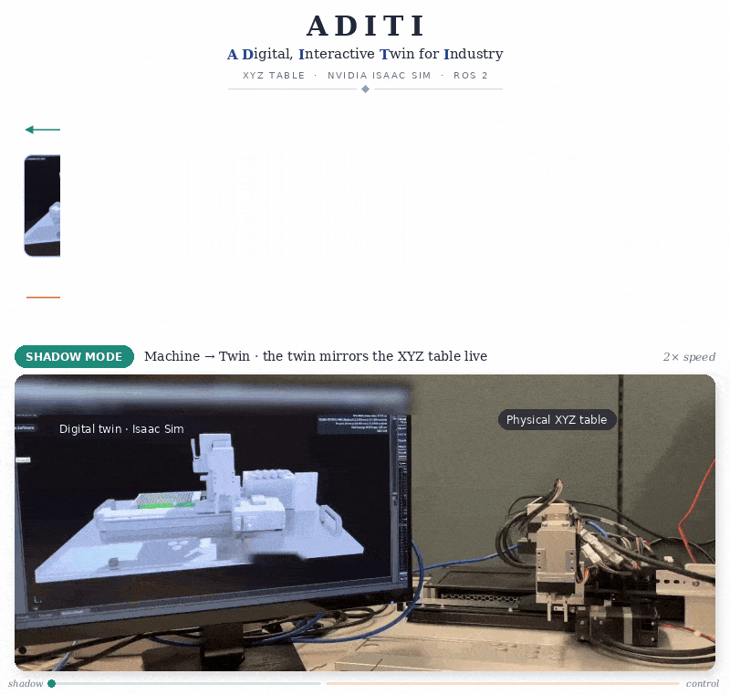
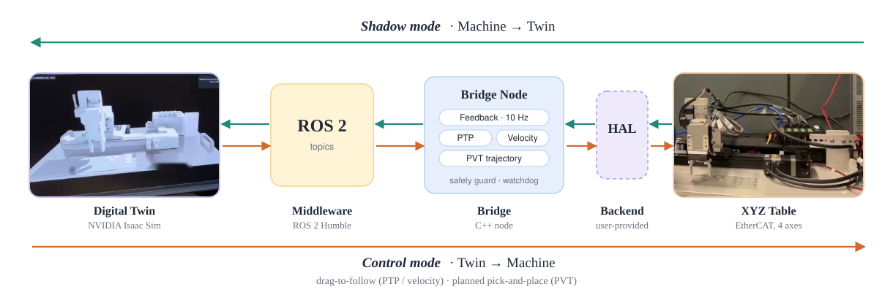

# ADITI: A Digital, Interactive Twin for Industry

A bidirectional digital twin that links a physical 4-axis XYZ table to NVIDIA Isaac Sim over ROS 2.

- **Shadow mode (Machine → Twin):** the simulation mirrors the machine in real time.
- **Control mode (Twin → Machine):** the machine executes motions commanded or planned in the simulation.

In the classification of Kritzinger et al. (2018), a one-way automatic link from the physical system is a *digital shadow*; only when the digital side also acts on the physical system automatically is it a *digital twin*. Shadow mode alone is the former; control mode closes the loop.



*Footage is sped up (2× and 3×) and edited to remove identifying marks. Each clip is a single continuous shot showing the twin and the machine together.*

## Status

This is a reference implementation built as an industrial digital-twin prototype (2025–2026).

- The original version ran end to end on real hardware, as shown in the demo.
- For publication, every call to the vendor-specific motion-control API was replaced with a hardware abstraction layer (`IMotionBackend`), and all vendor code, assets and identifiers were removed. Control logic, constants and call order were kept unchanged, apart from removing dead code, a legacy command lane and a drive-gain block that had no effect.
- The refactored code has not been built against ROS 2 since then. To run it, you need to implement `IMotionBackend` for your own motion controller (see [Hardware abstraction layer](#hardware-abstraction-layer)).
- The Isaac Sim stage (USD) is not included. The scene requirements are documented below.

## System overview

**Hardware.** An XYZ table with a two-finger gripper, driven by four motors (X, Y, Z and gripper) on ball screws, with stepper drives on an EtherCAT motion-control card and absolute encoders. In simulation the gripper appears as two mirrored prismatic joints, so four motors map to five joints.

**Software.** ROS 2 Humble, NVIDIA Isaac Sim 5.1 (Python 3.11), C++17 for the bridge node.

**Naming.** In code, the ROS 2 package, topic namespace and extension keep `gantry`, the working name of the machine during development (`gantry_bridge`, `/gantry/...`, `gantry.autopick`).



The system runs in three modes:

| Mode | Data flow |
|---|---|
| Shadow mode | The bridge node reads axis positions and publishes `joint_states` at 10 Hz. An Action Graph in Isaac Sim subscribes to it and drives the articulation. |
| Control mode: drag-to-follow | The user drags a target object in Isaac Sim. An Action Graph converts its pose into joint targets. The simulated joint states are throttled from 60 Hz to 10 Hz and sent to the PTP or velocity-following lane. |
| Control mode: planned pick-and-place | The Auto Pick extension plans a pick-and-place task as a chain of S-curve segments and sends each segment to the hardware as a PVT trajectory, while the simulation follows the same profile. |

### ROS 2 interface

| Topic | Type | Direction | Purpose |
|---|---|---|---|
| `joint_states` | `sensor_msgs/JointState` | out | Axis feedback at 10 Hz, joints `joint_1` to `joint_5`, in metres |
| `/gantry/cmd_position` | `std_msgs/Float64MultiArray` | in | Manual absolute move, `[X, Y, Z, gripper]` in metres, e.g. returning to home |
| `/gantry/cmd_ptp` | `sensor_msgs/JointState` | in | PTP lane (positions read by index: X, Y, Z, left finger) |
| `/gantry/cmd_velocity` | `sensor_msgs/JointState` | in | Velocity-following lane (joints matched by name) |
| `/gantry/cmd_pvt` | `trajectory_msgs/JointTrajectory` | in | PVT lane (joints matched by index) |
| `/gantry/pvt_error` | `std_msgs/Float64` | out | X-axis tracking error (cm) while a PVT trajectory runs |

Nothing in this repository publishes `/gantry/cmd_position`, `/gantry/cmd_ptp` or `/gantry/cmd_velocity`. In the original setup the position lane was driven manually with `ros2 topic pub`, and the other two were fed by an Action Graph through `topic_tools throttle`.

### Lane behavior

- **PTP:** incoming targets are filtered by a 100 ms minimum interval, a busy check on X and Y, a 0.1 mm deadzone and a 200-pulse per-axis threshold before a move is issued.
- **Velocity following:** runs once per incoming command. Axes starting from standstill are speed-capped, large initial gaps are closed at a low alignment gain, and a watchdog stops any jogging axis if no command arrives for 250 ms.
- **PVT:** each new trajectory emergency-stops every axis, resets axes in error, clears and reloads the PVT tables, then starts the axes. Inputs above 100 points are downsampled. While a trajectory runs, the velocity lane, watchdog and safety guard are locked out. The lock is released 500 ms after start once every axis is at standstill, and the actual positions become the new reference targets.
- **Safety guard:** outside PVT, any axis more than 8 cm from its last reference target triggers an emergency stop.

## Design evolution: PTP → velocity following → PVT

The bridge went through three command modes. All three remain in the code as separate lanes.

**1. Point-to-point (PTP).** Isaac Sim publishes joint states at 60 Hz; a throttle forwards them at 10 Hz, and each message that passes the lane's filters becomes an absolute PTP move. Every move is a full accelerate–cruise–decelerate profile, so continuous motion in simulation turned into a series of short stop-and-go moves on the hardware. A later review also found that the lane's "axis busy" check matches the stopping state rather than the moving state, so new targets interrupt moves still in progress, which likely made the jerk worse.

**2. Velocity following.** Instead of discrete targets, the node runs a continuous jog and updates its speed on every incoming command (10 Hz after throttling) with a proportional controller on position error, v = Kp · (x_sim − x_real), with the gain scheduled by error size. Motion became continuous, but tracking lagged visibly. Because the command is proportional to error and has no velocity feed-forward, the hardware only accelerates after an error has built up; the 10 Hz command rate and transport delay add to that. Gain tuning alone cannot remove this lag, since some error must always exist for the axis to move. Velocity feed-forward (v = v_sim + Kp · error) would address it directly.

**3. PVT.** For planned motions such as pick-and-place, the extension computes each segment in advance and sends it as one message with a position, velocity and timestamp for every point. The controller fits a cubic polynomial between each pair of points, matching position and velocity at both ends, and interpolates at its own servo rate. Velocity is continuous across points, and nothing depends on the 10 Hz ROS loop during the move. The simulation evaluates the same S-curve profile every frame, so the twin and the machine stay in sync by sharing one plan rather than one chasing the other.

**Trade-off.** PVT needs the trajectory in advance, so it suits planned motions, not interactive dragging; it cannot correct errors mid-move; and trajectory length is bounded by the controller's PVT buffer. Velocity following remains the mode for interactive use.

## Hardware abstraction layer

The bridge node talks to the motion controller only through `IMotionBackend` ([motion_backend.hpp](gantry_bridge/include/gantry_bridge/motion_backend.hpp)). The interface has one method per operation the node needs: open and close, motion profile, error reset and enable, absolute move, jog and velocity change, PVT reset/load/start, stop, and state, position and velocity reads.

Design choices:

- **Units stay in pulses at the backend.** Conversion between metres and pulses happens once, in the node. A backend is a thin wrapper around the controller.
- **Axis states follow the PLCopen Motion Control state machine** (`Disabled`, `Standstill`, `Stopping`, `ErrorStop`, `DiscreteMotion`, `ContinuousMotion`, ...). Most controllers map onto it directly, and it keeps vendor-specific state codes out of the node.
- **Reads return `std::optional`.** Where the original code silently treated a failed read as zero, the node now says so explicitly with `.value_or(0.0)`; failed state reads fall back to `AxisState::Disabled`. The fallback is now visible in the code instead of implicit.
- **Writes return `bool`, not error codes.** Vendor error codes stay inside the backend and its logs. As in the original, the node only checks the results of `open`, `move_absolute` and `load_pvt`.
- **PVT time is cumulative.** `time_ms` is milliseconds since the first point, so `time_ms[0] == 0`.

To build, provide a source file that implements `gantry_bridge::create_motion_backend()`:

```bash
colcon build --cmake-args \
  -DGANTRY_BACKEND_SOURCES=<path/to/your_backend.cpp> \
  -DGANTRY_BACKEND_LIBS=<your_controller_library>
```

Without a backend, CMake stops with an explanatory error.

## Isaac Sim side

### Scene requirements

- An articulation with its root at `/World/gantry` (set `ROBOT_PATH` in `brain.py` to change it).
- Five prismatic joints, `joint_1` to `joint_5`: X, Y, Z, left finger, right finger. The right finger is mirrored, so the bridge publishes it with the opposite sign.
- Stage units in metres.
- Pick targets `/World/Cube_Green`, `/World/Cube_Blue`, `/World/Cube_Red` and drop targets `/World/Bin_Green`, `/World/Bin_Blue`, `/World/Bin_Red`.

### Action Graphs

The original stage contained two Action Graphs, described here so they can be rebuilt.

- **Shadow mode:** `On Playback Tick` → `ROS2 Subscribe Joint State` (`joint_states`) → `Articulation Controller`, with a `ROS2 Context` node for the domain ID.
- **Drag-to-follow:** `On Playback Tick` → `Get Prim Local to World Transform` (the dragged object) → `Decompose Matrix` → `Break 3-Vector` → per-axis `Multiply` and `Add` with constants (scale and offset into joint space) → `Make Array` (X, Y, Z plus two constant finger values) → `Articulation Controller` position command. The resulting joint states are published as `/sim_joint_states` and throttled into the bridge, for example:

```bash
ros2 run topic_tools throttle messages /sim_joint_states 10.0 /gantry/cmd_ptp
```

### Auto Pick extension

`isaac_extension/gantry.autopick` is an Omniverse Kit extension with a small control window. While the robot is idle, selecting a bin (or pressing the matching button) picks the cube of the same colour and places it in that bin. Tasks are not accepted during a 3 s warm-up after Play or while another task is running.

A state machine runs each task as nine segments: approach, descend, grasp, lift, transfer, descend to bin, release, retract and return home. Each segment is a half-cosine S-curve with an analytic velocity profile, sent to the bridge as one PVT trajectory on `/gantry/cmd_pvt`. In the simulation, X, Y and Z are set directly from the same profile every frame, while the fingers are driven by physics.

The window shows the live tracking error from `/gantry/pvt_error`. "Load Latest Hardware Data" reads the bridge's PVT log and reports its maximum error, and "Reset State" resets the task state machine only (it does not stop the hardware). If `rclpy` is unavailable, the extension runs in simulation only.

To load it, add the `isaac_extension` folder as an extension search path in Isaac Sim (Window → Extensions → Settings), using an absolute path.

## Deployment notes

These problems came up on the original machine and are worth knowing for any similar setup.

- **Start order.** Start the bridge node first and wait until the axes report ready, then press Play in Isaac Sim.
- **Root vs. user processes.** Hardware access may require running the bridge as root while Isaac Sim runs as a normal user. Fast DDS then fails over shared memory because of file permissions. The fix is to force UDP transport with a profile and clear stale shared-memory files before starting:

  ```bash
  rm -rf /dev/shm/fastrtps_*
  export FASTRTPS_DEFAULT_PROFILES_FILE=<path/to/udp_only.xml>
  export ROS_DOMAIN_ID=0
  ```

  ```xml
  <?xml version="1.0" encoding="UTF-8"?>
  <profiles xmlns="http://www.eprosima.com/XMLSchemas/fastRTPS_Profiles">
    <transport_descriptors>
      <transport_descriptor>
        <transport_id>udp_only</transport_id>
        <type>UDPv4</type>
      </transport_descriptor>
    </transport_descriptors>
    <participant profile_name="udp_only_profile" is_default_profile="true">
      <rtps>
        <userTransports>
          <transport_id>udp_only</transport_id>
        </userTransports>
        <useBuiltinTransports>false</useBuiltinTransports>
      </rtps>
    </participant>
  </profiles>
  ```

- **Isaac Sim's bundled ROS 2.** When Isaac Sim is installed with pip, set `RMW_IMPLEMENTATION=rmw_fastrtps_cpp` and add the ROS 2 bridge's bundled `humble/lib` directory to `LD_LIBRARY_PATH` before launching.
- **Command rate.** Isaac Sim publishes joint states every frame (about 60 Hz). The original setup throttled them to 10 Hz before they reached the bridge.
- **CSV hand-off.** During PVT runs the bridge logs to `/tmp/gantry_pvt_log.csv`, which the extension can load. This assumes both run on the same machine.

## Known issues

The code preserves the behavior that was validated on hardware, including its flaws. The main issues are listed here; each is marked with a `Known issue:` comment in the source.

- **State checks.** The PTP lane's busy check matches only the stopping state, so new targets interrupt moves in progress.
- **Inconsistent lanes.** The lanes disagree on sim-to-hardware offsets and the gripper sign convention, and `last_sent_targets_` is written and read in different axis orders.
- **Safety gaps.** The PTP and position lanes apply no position limits; only the velocity and PVT lanes clamp. The position lane also bypasses the PTP lane's rate limit, busy check and deadzone. The safety guard compares against the last PTP target, so long PTP moves and velocity following beyond 8 cm can trigger it falsely. An axis stuck in an error state can hold the PVT lock indefinitely, which also disables the watchdog and the guard. The PTP and position lanes are not locked out while PVT runs.
- **PVT execution.** Axes are started one after another rather than with a synchronized multi-axis start, which controllers typically provide. The 100-point cap has not been verified against the controller's table size. Trajectories are sampled at a fixed 16 Hz with truncation, so some segments end slightly short of their target. PVT input is not size-checked.
- **Configuration.** The Y-axis startup profile was meant to be half speed but is 5× the default. The jog profile persists into later PTP moves.
- **Extension.** The PVT log is truncated at the start of each run, so "Load Latest Hardware Data" likely shows only the last segment. The "Max Tracking Error" label shows the latest value, not the maximum. The PVT publisher node is never destroyed on shutdown.

## Repository layout

```
gantry_bridge/                 ROS 2 package (C++)
├── include/gantry_bridge/
│   └── motion_backend.hpp     Hardware abstraction interface
├── src/gantry_bridge_node.cpp Bridge node: feedback and the PTP, velocity and PVT lanes
├── CMakeLists.txt
└── package.xml
isaac_extension/
└── gantry.autopick/           Isaac Sim extension (Python)
    ├── config/extension.toml
    └── auto_pick/
        ├── __init__.py        UI, event handling, live error display
        └── brain.py           Task state machine and S-curve PVT generator
tools/
├── velocity_profiler.py       Records commanded vs. actual X speed to CSV and a plot
└── plot.py                    Re-plots a recorded CSV
docs/                          Figures
```

`velocity_profiler.py` reads `velocity[0]` from `/gantry/cmd_velocity`, so the publisher must fill in the velocity field, even though the bridge itself ignores it.

## References

W. Kritzinger, M. Karner, G. Traar, J. Henjes and W. Sihn, "Digital Twin in manufacturing: A categorical literature review and classification," *IFAC-PapersOnLine*, vol. 51, no. 11, pp. 1016–1022, 2018.

## License

MIT. See [LICENSE](LICENSE).
